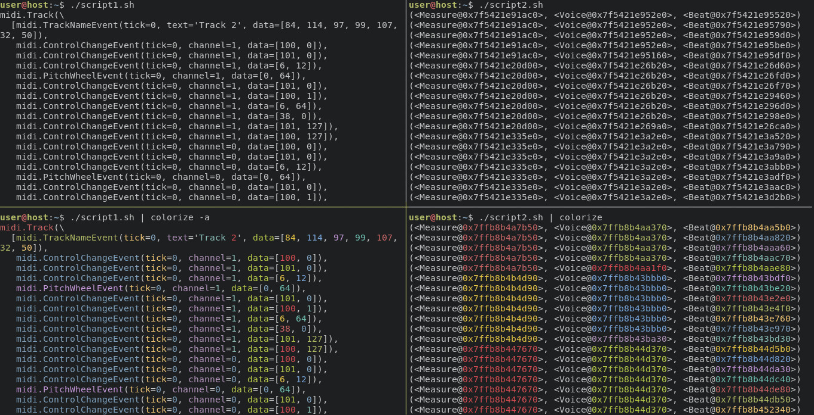

# colorize

## Description
`colorize` is a simple utility that employs color-coding in order to aid humans in parsing console output that contains a lot of similarly-looking words, especially numerals.

## Examples


## Installation
```bash
git clone https://github.com/Czaporka/colorize.git
cd colorize
make install
```
Alternatively, download a pre-built executable (compiled on Ubuntu):
```bash
curl --create-dirs -fLo ~/.local/bin/colorize https://github.com/Czaporka/colorize/releases/download/v1.2.0/colorize
chmod +x ~/.local/bin/colorize
```
Make sure `~/.local/bin` is on your `PATH`, e.g.:
```bash
export PATH=${PATH}:~/.local/bin
echo 'export PATH=${PATH}:~/.local/bin' >> ~/.bashrc
```

## Usage
```
Usage: colorize [--help|-h] [--all|-a] [--cycle|-c] [--regex|-r REGEX] [--salt|-s SALT]

Colorize text (by default just numerals).

Example: df | colorize
Example: colorize -a < file.txt

Optional arguments:
  -h, --help        show this help message and exit
  -a, --all         colorize all words, not just numerals
  -c, --cycle       cycle through the list of colors rather than pick the color
                    based on the token's hash; this option makes
                    token-to-color mapping inconsistent across
                    executions and is probably not useful at all
  -r, --regex=REGEX use an arbitrary REGEX for finding the tokens
  -s, --salt=SALT   append a salt to every token before hashing, effectively shuffling the colors
```
