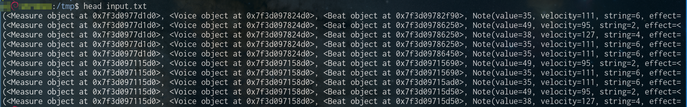
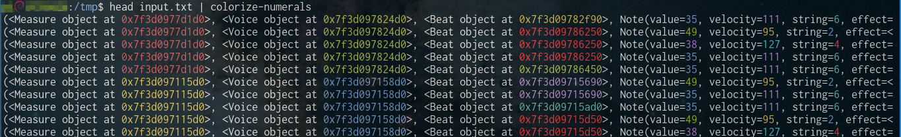

# colorize-numerals

## Description
`colorize-numerals` is a simple utility that employs color-coding in order to aid humans in parsing console output that contains a lot of numbers.  
By applying the same distinct color to every occurrence of a number, hopefully it should make it easier to figure out what is what.

For example,  
It is difficult to understand what is happening here:


This looks much better:


## How to install?
```bash
git clone https://github.com/Czaporka/colorize-numerals.git
cd colorize-numerals
make colorize-numerals
mkdir -p ~/.local/bin
cp colorize-numerals ~/.local/bin
```
Make sure `~/.local/bin` is on your `PATH`:
```bash
echo 'export PATH=${PATH}:~/.local/bin' >> ~/.bashrc
```
